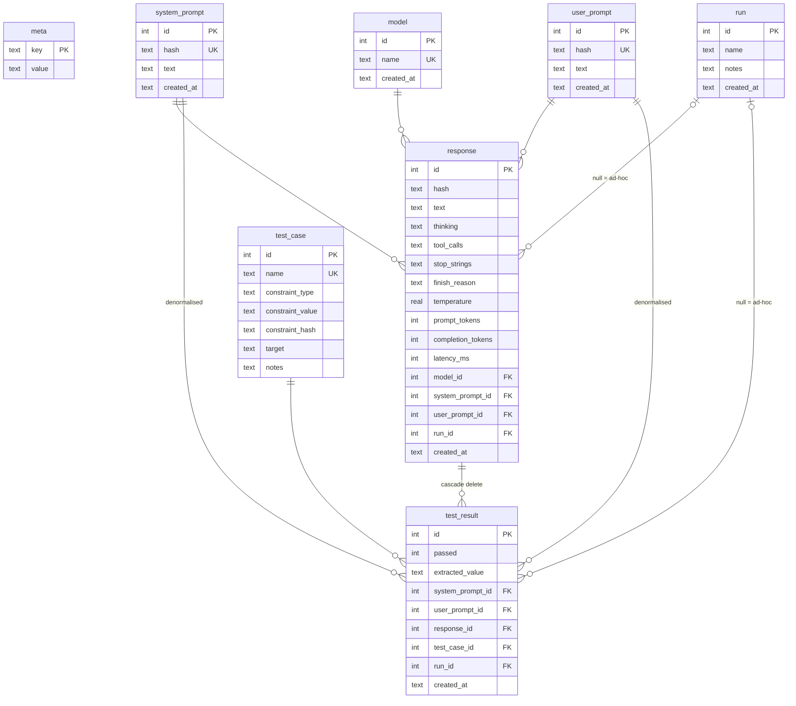

# Bench Database — Entity Relationship Diagram

## Target path syntax

The `test_case.target` field is a dot-path expression resolved against the
parsed response at evaluation time:

| Target                      | Resolves to                                      |
|-----------------------------|--------------------------------------------------|
| `tool_call[0].output`       | `output` routing arg of the first tool call      |
| `tool_call[0].name`         | Name of the first tool called                    |
| `tool_call[0].args.<key>`   | Arbitrary arg of the first tool call             |
| `tool_call[1].output`       | `output` arg of the second tool call             |
| `reasoning`                 | Thinking block text (null if absent)             |
| `response`                  | Parsed final response text                       |
| `message`                   | Full raw completion (thinking + tokens + text)   |

## Constraint types

`test_case.constraint_type` controls how `test_case.constraint_value` is
applied to the extracted value:

| Type         | `constraint_value` | Passes when                                           |
|--------------|-------------------|-------------------------------------------------------|
| `absent`     | NULL              | extracted value is NULL                               |
| `present`    | NULL              | extracted value is non-NULL                           |
| `min_length` | integer string    | `len(extracted_value) >= int(constraint_value)`       |
| `max_length` | integer string    | `len(extracted_value) <= int(constraint_value)`       |
| `regex`      | Python regex      | `re.search(constraint_value, extracted_value)` truthy |

Note: the former exact-match patterns from `sinks.tsv` (`display`, `$*`,
`file:*`) are expressed as `regex` constraints: e.g. `^display$`, `^\$`,
`^file:`.

## Test case versioning

`test_case.name` is `UNIQUE`. Changing `constraint_type`, `constraint_value`,
or `target` requires a new row with a new name (e.g. `display_natural_v2`).
Do not edit constraints in place — `test_result` rows reference a test case by
id, so an in-place edit silently changes what historical results mean.

`constraint_hash` is `SHA-256(constraint_type || ':' || COALESCE(constraint_value, '') || ':' || target)`.
It is drift-detection only: if the hash stored on a row no longer matches a
freshly computed hash of its own fields, the row was edited in place. The hash
is writer-trusted — there is no DB-layer enforcement.

## Notes

- `response.hash` and `system_prompt.hash` / `user_prompt.hash` are SHA-256
  of their respective `text` fields. `system_prompt.hash` and `user_prompt.hash`
  are `UNIQUE` (same text → same row). `response.hash` is **not** `UNIQUE`:
  repeated invocations at low temperature often produce identical text, and each
  invocation must have its own row for stability tracking.
- `response.tool_calls` is a JSON array of `{name, args}` objects, one per
  tool call made during the completion, in order. Validated with `json_valid()`.
- `response.stop_strings` is a JSON array, e.g. `["<turn|>", "<|tool_response>"]`.
  Validated with `json_valid()`.
- `response.finish_reason` is one of `'stop'`, `'length'`, `'tool_calls'`,
  `'error'`, or NULL (when not reported by the backend).
- `response.temperature`, `prompt_tokens`, `completion_tokens`, and `latency_ms`
  are NULL when the backend does not report them.
- `response.model_id` references `model.id`. The `model.name` column stores
  the canonical model identifier (case-insensitive unique). Insert into `model`
  on first use; `INSERT OR IGNORE INTO model(name) VALUES (?)` is safe.
- `test_result(response_id, test_case_id)` is `UNIQUE` — one evaluation per
  response × test case pair. Re-evaluation requires deleting the old row first.
- `test_result.{system_prompt_id, user_prompt_id, run_id}` are denormalised
  from the parent `response` row. A `BEFORE INSERT/UPDATE` trigger enforces
  they always match the parent. Always set all three in the same statement.
- Deleting a `response` row cascades to all its `test_result` rows.
  All other FK relationships use `ON DELETE RESTRICT`.
- `run_id = NULL` on both `response` and `test_result` indicates an ad-hoc
  single invocation outside any named run.
- Per-connection setup required in application code (not enforced by schema.sql):
  `PRAGMA journal_mode = WAL;` and `PRAGMA foreign_keys = ON;`.
